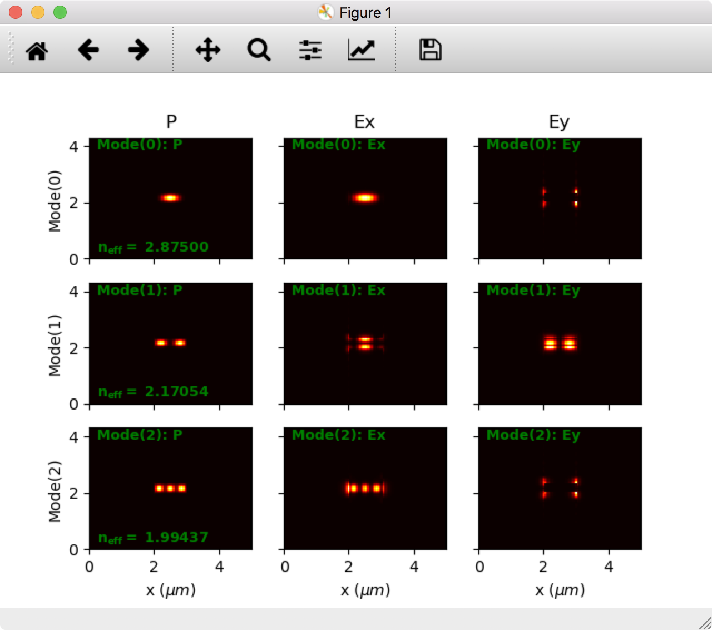

# CAMFR

Forked from [Sourceforge project](http://camfr.sourceforge.net/) for maintenance.

Originally written by [Peter Bienstman at Ghent University, Belgium](http://www.photonics.intec.ugent.be/contact/people.asp?ID=5).

## Introduction

CAMFR (CAvity Modelling FRamework) is a fast, flexible, friendly full-vectorial Maxwell solver for electromagnetics simulations. Its main focus is on applications in the field of nanophotonics, like
- wavelength-scale microstructures (like photonic crystal devices, optical waveguides)
- lasers (like vertical-cavity surface-emitting lasers)
- light-emitting diodes (like resonant-cavity LEDs)

It is based on a combination of eigenmode expansion and advanced boundary conditions like perfectly matched layers (PML).  

Using an intuitive python scripting interface one can create and solve for the optical modes/fields in various wavelength-scale structures. Additional math and plotting can then be performed via the SciPy stack. The Eigenmode Expansion (EME) method is especially well-suited to solving for very thin layers, or structures in which the X and Y dimensions are very different, where typical methods like FDTD and FEM have trouble with the vastly differing X/Y discretization.

You can find more information, publications and details [here](http://www.photonics.intec.ugent.be/research/topics.asp?ID=17).

## Features

CAMFR was a research project, started at the photonics group of the Department of Information Technology (INTEC) at Ghent University in Belgium. CAMFR can be used to calculate
- the scattering matrix of a structure
- the field inside a structure, for any given excitation
- band diagrams of an infinite periodic structure
- threshold material gain and resonance wavelength of laser modes
- the response to a current source in an arbitrary cavity
- structures terminated by a semi-infinite repetition of another structure

This functionality is currently available for two types of geometries:
- 2D Cartesian structures
- 3D cylindrical symmetric structures

Additionally, there is code to model the extraction from light emitting diodes, either planar devices, or 3D devices which incorporate 2D periodic structures.

Defining structures is quite straightforward, either layer-by-layer, or using geometric primitive shapes. There are also integrated plotting routines for rapid simulation feedback.

## Framework character

CAMFR is conceived as a C++ framework, with all the algorithms implemented in terms of abstract waveguides and scatterers. This makes it extremely easy to extend CAMFR to new geometries.

The end user does not deal with this C++ code directly, but rather through bindings to the Python scripting language. This makes the code very clear and flexible, and allows e.g. to seamlessly integrate CAMFR with Python-aware visualistion tools such as [matplotlib](https://matplotlib.org) and [numpy](http://www.numpy.org).

## Examples
### Silicon Waveguide Mode Solver

## Installation
pyFIMM currently only supports Python 2.7.

To use pyFIMM, simply download one of the released versions (see the "releases" or "tags" section of this page), or the bleeding-edge code, and extract the archive into a directory.  Your Python script should reside in the same directory as the *pyfimm* folder, or else you should add the parent directory of the *pyfimm* folder to your Python path at the beginning of your script.    

The preferred method to run your scripts is through a Python IDE like Spyder (a matlab-like IDE).  The simplest installation of Spyder (along with all typical scientific python modules) can be accomplished via [Python(x,y)](https://code.google.com/p/pythonxy/) (Win) or [Anaconda](http://continuum.io/downloads) (Mac,Win,Linux). 

These pyfimm scripts can also be run like any typical Python script on the command line via `python myScript.py` or `python -i myScript.py` to make it interactive afterwards.

## License and support

All the code is released under the GPL.
